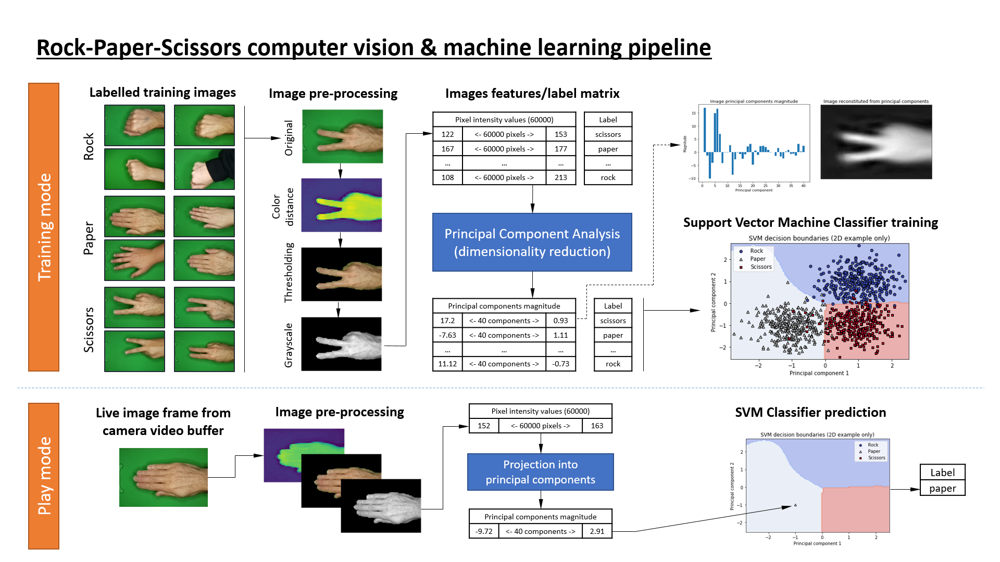

# Rock-Paper-Scissors
EECE 570 Computer Vision Project
A Rock-Paper-Scissors game using computer vision and machine learning on Raspberry Pi.

## Summary
### Overview of the game

The game uses a Raspberry Pi computer and Raspberry Pi camera installed on a support with LED strips to achieve consistent images.

The pictures taken by the camera are processed and fed to an image classifier that determines whether the gesture corresponds to "Rock", "Paper" or "Scissors" gestures.

The image classifier uses a [Support Vector Machine](https://en.wikipedia.org/wiki/Support_vector_machine), a class of [machine learning](https://en.wikipedia.org/wiki/Machine_learning) algorithm. The image classifier has been priorly "trained" with a bank of labeled images corresponding to the "Rock", "Paper", "Scissors" gestures captured with the Raspberry Pi camera.

### How it works

The image below shows the processing pipeline for the training of the image classifier (top portion) and the prediction of gesture for new images captured by the camera during the game (bottom portion).

## Dependencies

The project depends on and has been tested with the following libraries:

* OpenCV >= 3.3.0 with bindings for Python 3*
* Python >= 3.4+
* Numpy >= 1.13.0
* Scikit-Learn >= 0.18.2
* Scikit-Image >= 0.13.0
* Pygame >= 1.9.3
* Picamera

\* Follow [this guide](https://www.pyimagesearch.com/2016/04/18/install-guide-raspberry-pi-3-raspbian-jessie-opencv-3/) for installation of OpenCV on the Raspberry Pi. Install Python libraries within the same virtual environment as OpenCV using the `pip install <package_name>` command. Picamera is installed by default on [Raspbian](https://www.raspberrypi.org/downloads/raspbian/) images.

### Hardware:

* [Raspberry Pi 3 Model B or B+ computer](https://www.raspberrypi.org/products/raspberry-pi-3-model-b-plus/)
* [Raspberry Pi Camera Module V2](https://www.raspberrypi.org/products/camera-module-v2/)
* A green background to allow background subtraction in the captured images.
* A physical setup for the camera to ensure consistent lighting and camera position.

## Program files

* *image_capture.py*  
This file opens the camera in "capture mode", to capture and label images that will later be used to train the image classifier. The captured images are automatically named and stored in a folder structure.

* *train.py*  
This script reads and processes the training images in preparation for training the image classifier. The processed image data is then used to train the support vector machine image classifier. The trained classifier is stored in the `clf.pkl` file read by `maindriver.py`.

* *maindriver.py*  
This file runs the actual Rock-Paper-Scissors game using the camera and the trained image classifier in a graphical user interface (GUI). Images from each play are captured and added to the image bank, creating additional images to train the classifier.

## Library modules

* *utilityfunctions.gui*  
This module defines the RPSGUI class and associated methods to manage the game
 graphical user interface (GUI).

* *utilityfunctions.imgproc*  
This module provides the image processing functions used by the various other Python files.

* *utilityfunctions.utils*  
This module provides functions and constants used by the various other Python files.

* *utilityfunctions.camera*  
This module defines the Camera class, a wrapper around the picamera library, with specific methods for the project such as white balance calibration.

## Refer Report for Output Snapshots
